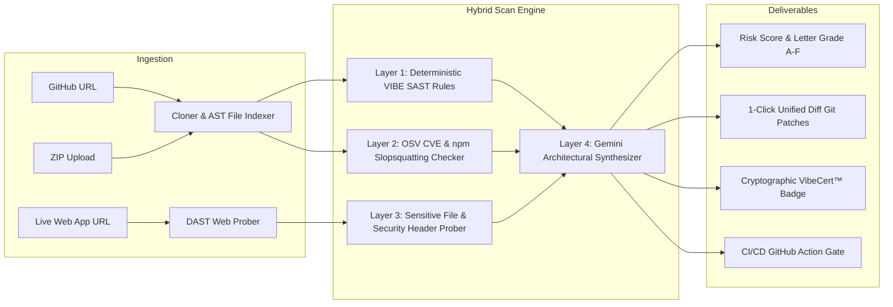

# 🛡️ VibeScan — AI Security Audit & Auto-Remediation Engine
> **Industry-grade automated security scanner and code-hardening engine for AI-generated ("vibe-coded") applications.**
> Built specifically for projects created with Cursor, Bolt.new, Lovable, v0, Windsurf, Claude Code, and Replit.

[](LICENSE)
[](https://owasp.org/www-project-top-10-for-large-language-model-applications/)
[](https://zeerocodes.com#vibescan)

---

## 🚀 Why VibeScan?

AI coding assistants write code that looks visually complete and functions on the surface, but systematically introduce **dangerous architectural backdoors**:
1. **Exposing API keys in client-side Vite/Next.js bundles** (`VITE_OPENAI_API_KEY`, `NEXT_PUBLIC_PAYSTACK_SECRET`).
2. **Missing or permissive Row-Level Security (RLS)** in Supabase/Firebase datastores.
3. **Insecure webhook signature checks** (vulnerable to timing attacks or payment spoofing).
4. **Direct prompt injection** from unvalidated `req.body` interpolated into LLM system prompts.
5. **AI Hallucinated / Slopsquatted packages** referenced in `package.json`.

**VibeScan** provides a deterministic **Static Analysis (SAST)** engine, **Active Dynamic Endpoint Probing (DAST)**, and **AI Architectural Remediation** that delivers actionable Git unified diff patches.

---

## 🏛️ Architecture Overview



---

## 📋 The 10 Core VIBE Security Rules Matrix

| Rule ID | Category | Severity | OWASP LLM | Description & Mitigation |
| :--- | :--- | :--- | :--- | :--- |
| **`VIBE-001`** | `hardcodedSecrets` | **CRITICAL** | **LLM02** | **Exposed AI Model Keys**: Detects OpenAI (`sk-`), Anthropic (`sk-ant-`), and Google keys in frontend bundles. |
| **`VIBE-002`** | `hardcodedSecrets` | **CRITICAL** | **LLM02** | **Exposed African Payment Secrets**: Detects Paystack (`sk_live_`, `sk_test_`) and Flutterwave (`FLWSECK_`) secret keys. |
| **`VIBE-003`** | `hardcodedSecrets` | **CRITICAL** | **LLM02** | **Exposed Global Payment Keys**: Detects Stripe secret keys (`sk_live_`, `rk_live_`) and webhook signing secrets (`whsec_`). |
| **`VIBE-004`** | `hardcodedSecrets` | **CRITICAL** | **LLM02** | **Supabase Service Role Key on Client**: Detects `SUPABASE_SERVICE_ROLE_KEY` used in `src/` or `app/` client files. |
| **`VIBE-005`** | `webhookSecurity` | **HIGH** | **LLM05** | **Insecure Webhook HMAC Verification**: Flags webhook endpoints lacking constant-time `crypto.timingSafeEqual` comparison. |
| **`VIBE-006`** | `hardcodedSecrets` | **CRITICAL** | **LLM02** | **Database Plaintext Password Leak**: Detects database connection URIs with embedded plaintext passwords. |
| **`VIBE-007`** | `promptSecurity` | **HIGH** | **LLM01** | **Direct Prompt Injection**: Detects raw user input directly concatenated into LLM system prompts without delimiters. |
| **`VIBE-008`** | `owasp` | **CRITICAL** | **LLM05** | **Unsafe Dynamic Execution & SQL Injection**: Detects `eval()`, unsanitized `exec()`, raw SQL interpolation, and unescaped HTML. |
| **`VIBE-009`** | `accessGaps` | **HIGH** | **LLM02** | **Permissive CORS with Credentials**: Flags wildcard CORS (`*`) on authenticated endpoints. |
| **`VIBE-010`** | `promptSecurity` | **MEDIUM** | **LLM10** | **Unbounded LLM Consumption (Denial of Wallet)**: Flags LLM completion calls lacking `max_tokens` limits. |

---

## 🌐 DAST Active Live Web Probing

When testing live deployment URLs (e.g. `https://my-app.vercel.app`), VibeScan dynamically probes:
- **Sensitive Dotfile & Config Leaks**: Checks access to `/.env`, `/.git/config`, `/.env.local`, and `/api/debug`.
- **Security Headers Compliance**: Audits `Strict-Transport-Security` (HSTS), `Content-Security-Policy` (CSP), `X-Frame-Options`, `X-Content-Type-Options`, and `Referrer-Policy`.
- **MIME Sniffing & Framing Defense**: Validates protection against Clickjacking and MIME confusion exploits.

---

## 🛠️ API Reference

### 1. Initiate Repository Scan
```http
POST /api/scan
Content-Type: application/json

{
  "url": "https://github.com/username/my-vibe-app"
}
```

### 2. Upload ZIP Bundle for Scan
```http
POST /api/scan/upload
Content-Type: multipart/form-data
Body: file=<archive.zip>
```

### 3. Fetch Scan Status & Remediation Report
```http
GET /api/scan/:id
```

**Sample Response:**
```json
{
  "status": "completed",
  "result": {
    "repo": "username/my-vibe-app",
    "grade": "B",
    "score": 85,
    "findingsCount": 2,
    "findings": [
      {
        "ruleId": "VIBE-005",
        "category": "webhookSecurity",
        "severity": "HIGH",
        "title": "Webhook Signature Missing Constant-Time Verification",
        "file": "api/paystack-webhook.ts",
        "lineNumber": 14,
        "fixSuggestion": "Use crypto.timingSafeEqual to prevent timing attacks.",
        "diffPatch": "--- a/api/paystack-webhook.ts\n+++ b/api/paystack-webhook.ts\n- if (signature === hash) {\n+ if (crypto.timingSafeEqual(Buffer.from(signature), Buffer.from(hash))) {"
      }
    ]
  }
}
```

---

## 🤖 GitHub Actions CI/CD Integration

Gate your Pull Requests to ensure AI assistants never commit vulnerable code:

```yaml
# .github/workflows/vibescan.yml
name: VibeScan Security Gate
on: [push, pull_request]

jobs:
  audit:
    runs-on: ubuntu-latest
    steps:
      - name: Checkout Code
        uses: actions/checkout@v4

      - name: Run VibeScan Audit
        uses: zeerocodez/vibescan-action@v1
        with:
          fail-on: 'CRITICAL,HIGH'
```

---

## 📜 License

Engineered by **Zeerocodes** • Principal Architect: **Nuel Effiong**  
Licensed under the [MIT License](LICENSE).
